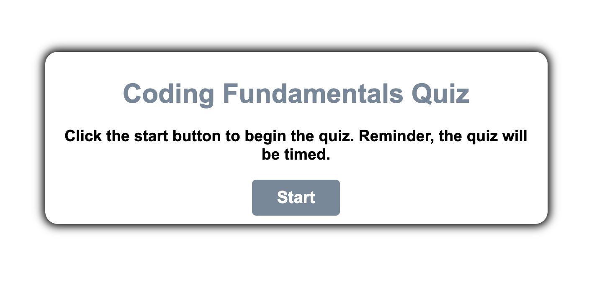
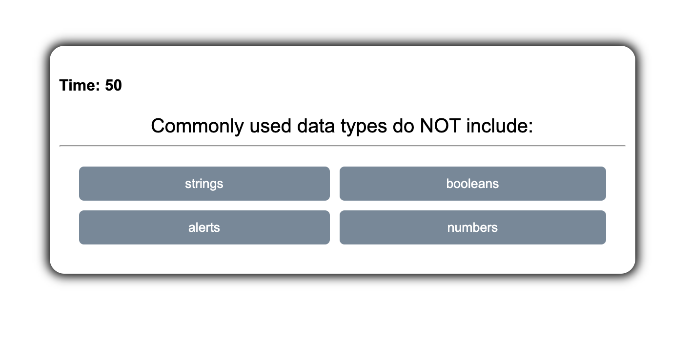
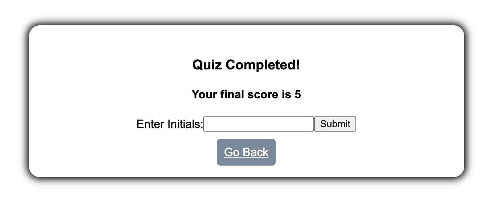

# Coding Fundamentals Quiz

## Description

Test your coding knowledge with this short quiz! In this repository, you will find code to a quiz app that consists of HTML, CSS, and JavaScript. The design is simple, however, it allows the user to focus on the questions and answer choices for the quiz.

## Function

As seen above, the user is prompted with a start button at first. Once the user clicks start, the quiz will begin, and a timer for 60 seconds will begin to countdown. 

When a user clicks an answer, there are two possibilities. On one end, the user has answered correctly, and the timer will continue normally. On the other end, if the user answered incorrectly, the timer will reduce by ten seconds. Either way, once the user clicks an answer, they will then be prompted with the next question and answers. 

Once all questions have been answered, the user will be shown that the quiz is complete, and their score will appear on the screen. If the user chooses to save their high schore, they may type their initials and click submit. The score will then be saved into local storage, and the user will be taken back to the beginning of the app. If the user does not wish to save their score, they may click the "Go Back" button, and then be taken to the home page. 

## Future Development

In the near future, I wish to add a high scores page, so that any user can see a list of previous scores from other players. 

## Technologies Used

* HTML 
* CSS 
* JavaScript

